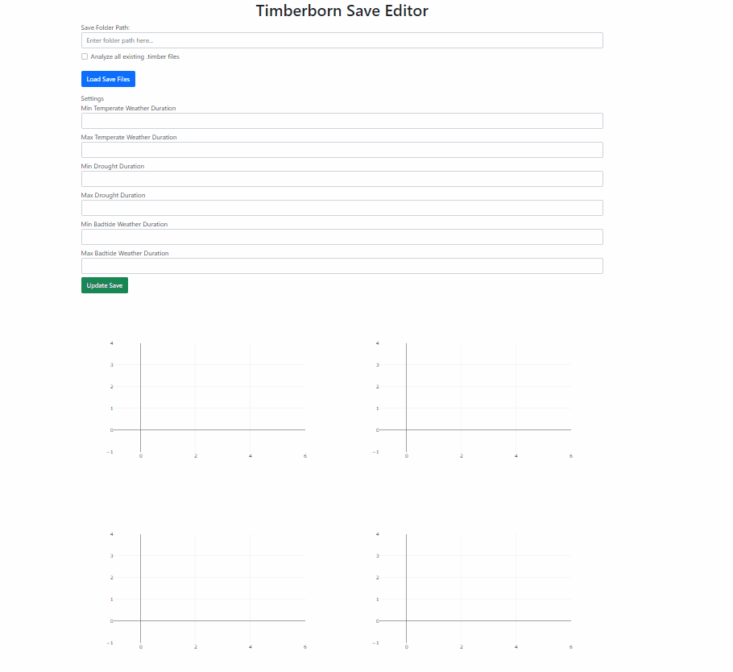
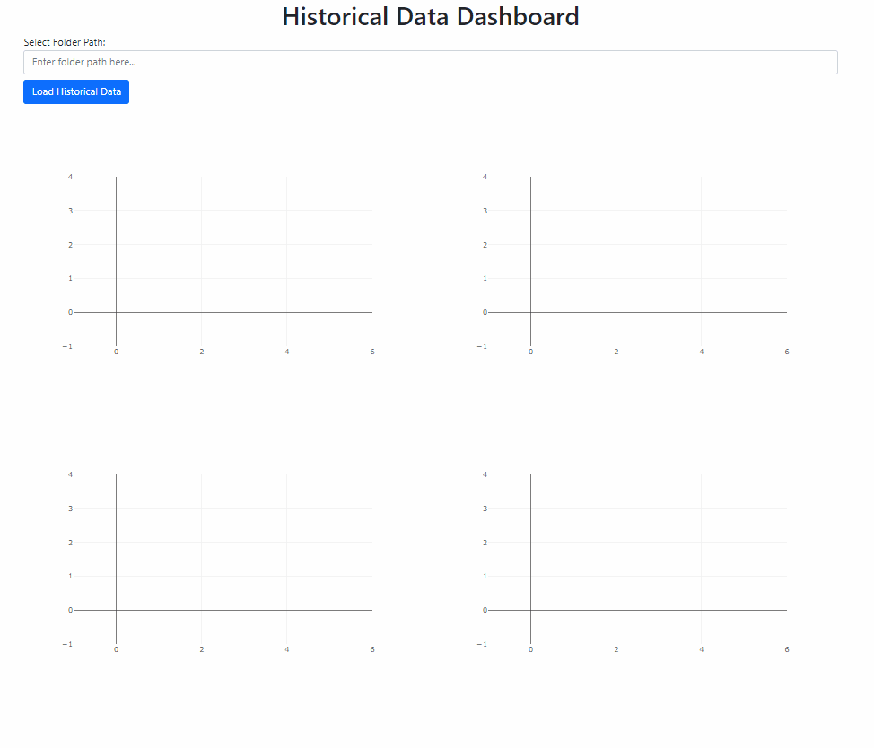

# Timberborn Save Editor and Historical Data Dashboard

This project consists of two Dash web applications for managing and visualizing Timberborn save files and historical data. The first application (`app.py`) allows users to modify some game settings and analyze save files, while the second application (`historical_dashboard.py`) provides a detailed dashboard to visualize historical data.

## Project Structure

project_directory/

├── app.py

├── historical_dashboard.py

└── utils/tools.py


- `app.py`: Main application for modifying game settings and analyzing save files.
- `historical_dashboard.py`: Dashboard for visualizing historical data.
- `utils/tools.py`: Contains the utility classes for handling save files, historical data, game settings, and weather/water/moisture information.


## Features

### app.py

- Load and analyze Timberborn save files.
- Modify some game settings (e.g., weather durations) on the latest game save file, the player need to load the latest game save to see the changes.

- Display current game statistics including clean water amount and weather info.
- Visualize water depth, contamination, moisture, and soil contamination heatmaps.
- For each new detected game save (.timber file), it appends relevent map information to a historical data file "historical_data.json" in the same game save folder. This file will be used by historical_dashboard.py


   


### historical_dashboard.py

- Load and display historical data that was generated by app.py: "historical_data.json" .
- Display animated heatmaps for water depth, contamination, moisture, and soil contamination.
- Graph to visualize total water amount over time.
- Slider to scroll through different days and cycles.

   


## Installation

Note: This project is only tested with Python 3.11 

1. Clone the repository:
    ```bash
    git clone https://github.com/amine101/timberborn-dashboard.git
    cd timberborn-dashboard
    ```

2. Create and activate a virtual environment:
    ```bash
    python -m venv venv
    source venv/bin/activate   # On Windows: venv\Scripts\activate
    ```

3. Install the required packages:
    ```bash
    pip install -r requirements.txt
    ```

## Usage

### Running app.py

1. Run your Timberborn game and remember your selected settlement name.


2. Run the application:
    ```bash
    python app.py
    ```

3. Open your browser and go to `http://127.0.0.1:8050`.

4. In the "Save Folder Path" field, enter the path to the Game save folder of the settlemnt that you loaded:

     - Standard game: "%USERPROFILE%\Documents\Timberborn\Saves\<your settlement name>"
     - Experimental game: - "%USERPROFILE%\Documents \Timberborn\ExperimentalSaves\<your settlement name>"

5. Now you should see the data of the latest detected save fime (.timber file) loaded, feel  free to modify some of the game settings ( you have to load the game again - latest save) or observe some of the data as heatmaps. 

    Modifiable Settings :

    - Min/Max Temperate Weather Duration
    - Min/Max Drought  Duration
    - Min/Max Badtide Weather Duration

    Heatmaps:

    - Historical Water Depth heatmap
    - Historical Contamination  heatmap
    - Historical Moisture levels heatmap
    - Historical Soil contamination heatmap


### Running historical_dashboard.py

1. Run the application app.py long enough to gather historical data

2. Run the application:
    ```bash
    python historical_dashboard.py
    ```

3. Open your browser and go to `http://127.0.0.1:8051`.

4. In the "Select Folder Path" field, enter the path to the Game save folder of the settlemnt that you loaded:

     - Standard game: "%USERPROFILE%\Documents\Timberborn\Saves\<your settlement name>"
     - Experimental game: - "%USERPROFILE%\Documents \Timberborn\ExperimentalSaves\<your settlement name>"

5. Now you should be ale to see the historical data of the settlemnt

    Animated Heatmaps:

    - Water Depth heatmap
    - Contamination  heatmap
    - Moisture levels heatmap
    - Soil contamination heatmap

    Graphs :

    - Total Amout of Water Over Time

## Detailed Overview

### utils/tools.py

#### SaveFileHandler

- **Methods**:
  - `__init__(self, directory)`: Initialize with the save files directory.
  - `load_all_files(self)`: Load all `.timber` files from the directory.
  - `load_latest_file(self)`: Load the latest `.timber` file.
  - `read_world_data(self, path)`: Read world data from a `.timber` file.
  - `save_world_data(self, path, game_data)`: Save world data to a `.timber` file.

#### HistoricalDataHandler

- **Methods**:
  - `__init__(self, directory, file_name="historical_data.json")`: Initialize with the directory and historical data file name.
  - `save_historical_data(self, data)`: Save data to the historical data file.
  - `get_historical_data(self)`: Get data from the historical data file.

#### SettingsModifier

- **Methods**:
  - `__init__(self, game_data)`: Initialize with game data.
  - `update_settings(self, new_values)`: Update game settings.
  - `get_current_settings(self)`: Get current game settings.

#### WeatherAndWaterAndMoistureInfo

- **Methods**:
  - `__init__(self, game_data)`: Initialize with game data.
  - `calculate_total_clean_water(self)`: Calculate total clean water.
  - `get_weather_info(self)`: Get weather information.
  - `get_water_levels_matrix(self)`: Get water levels matrix.
  - `get_contamination_percentage_matrix(self)`: Get contamination percentage matrix.
  - `get_moisture_levels_matrix(self)`: Get moisture levels matrix.
  - `get_soil_contamination_matrix(self)`: Get soil contamination matrix.

### app.py

- **Components**:
  - Input for the folder path.
  - Button to load save files.
  - Input fields for weather duration settings.
  - Button to update save files.
  - Display for clean water amount and weather info.
  - Heatmaps for water depth, contamination, moisture, and soil contamination.

- **Callbacks**:
  - `handle_buttons`: Handles loading and updating of save files.

### historical_dashboard.py

- **Components**:
  - Input for the folder path.
  - Button to load historical data.
  - Animated heatmaps for water depth, contamination, moisture, and soil contamination.
  - Graph for total water amount over time.
  - Slider to scroll through different days and cycles.

- **Callbacks**:
  - `update_dashboard`: Updates the dashboard with historical data.

## Contributing

Feel free to open issues or submit pull requests for improvements and bug fixes.

## License

This project is licensed under the MIT License.
